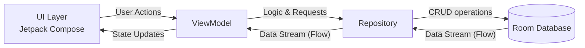
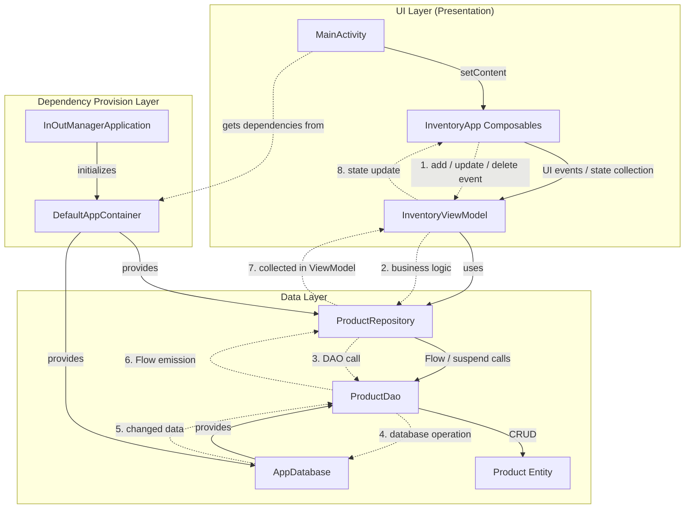

# InOutManager (재고 관리 앱)

Jetpack Compose와 Room Database를 활용하여 개발된 안드로이드 기반의 재고 관리 애플리케이션입니다. 
상품의 입출고 내역을 기록하고, 현재 재고 상태를 직관적으로 파악할 수 있도록 돕습니다.

## 📌 주요 기능 (Features)
- **입고 관리 (Inbound)**: 새로운 상품이 들어올 때 수량 및 관련 내역을 안전하게 기록합니다.
- **출고 관리 (Outbound)**: 상품이 출고될 때 재고 수량을 차감하고 내역을 관리합니다.
- **재고 현황 (Status)**: 현재 등록된 모든 상품의 재고 상태를 한눈에 확인할 수 있는 목록을 제공합니다.

## 🛠 기술 스택 (Tech Stack)
- **Language**: Kotlin
- **UI Toolkit**: Jetpack Compose
- **Architecture**: MVVM (Model-View-ViewModel) 패턴
- **Local Database**: Room Database (SQLite DB)
- **Asynchronous Programming**: Kotlin Coroutines & Flow

## 📂 프로젝트 구조 (Modules)
- `app/` : 메인 애플리케이션 모듈입니다. 핵심 UI 화면(`InboundScreen`, `OutboundScreen`, `StatusScreen`)과 Data 로직(`ProductDao`, `ProductRepository`)이 위치합니다.
- `app_comment/` : 애플리케이션의 핵심 코드에 주석과 설명 등 부가적인 학습/리뷰 목적의 서브 모듈입니다.

## 📊 아키텍처 (Architecture)

본 프로젝트는 **MVVM 아키텍처**와 **단방향 데이터 흐름(UDF)**을 따르고 있습니다. 복잡한 상세 구현보다 전체적인 데이터 흐름을 직관적으로 파악할 수 있는 추상화된 구조는 다음과 같습니다.

<b>🔍 상세 아키텍처 및 UML 클래스 다이어그램 보기</b>

 

클래스 간의 의존성 주입(DI), 싱글톤 패턴이 적용된 상세 구현 내용 및 전체 UML 다이어그램은 아래 문서에서 확인할 수 있습니다.
- [Architecture & Class Diagram 상세 보기](./docs/architecture.md)

