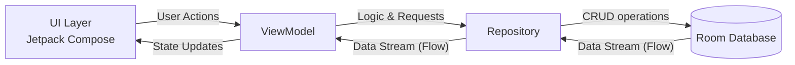

# 📦 InOutManager (재고 관리 앱)

**InOutManager**는 소규모 비즈니스 또는 개인의 사물, 상품들의 재고 상태를 체계적이고 직관적으로 관리할 수 있도록 돕는 안드로이드 애플리케이션입니다. 
Jetpack Compose 기반의 깔끔한 UI를 통해 입고와 출고 내역을 간편하게 기록하고, 현재 남은 재고 수량을 실시간으로 빠르고 정확하게 파악할 수 있습니다.

## 📱 앱 소개 (Overview)
- **손쉬운 재고 관리**: 직관적인 인터페이스로 누구나 쉽게 상품을 등록하고 입출고 처리를 할 수 있습니다.
- **실시간 현황 파악**: 모든 상품의 재고 수량과 입/출고 변동 내역을 한눈에 확인할 수 있습니다.
- **오프라인 동작**: Room Database를 사용하여 인터넷 연결 없이도 빠르고 안전하게 데이터를 기기 내에 저장하고 조회합니다.

## ✨ 핵심 기능 (Features)
1. **📥 입고 관리 (Inbound)**: 새로운 상품이 들어올 때 수량 및 관련 내역을 빠르고 안전하게 기록합니다.
2. **📤 출고 관리 (Outbound)**: 상품이 출고되거나 판매될 때 재고 수량을 정확히 차감하고 출고 내역을 기록합니다.
3. **📊 재고 현황 (Status)**: 현재 등록된 전체 상품의 목록과 남은 재고 파악을 리스트 형태로 한눈에 보여줍니다.

## 🛠 기술 스택 (Tech Stack)
- **Language**: Kotlin
- **UI Toolkit**: Jetpack Compose (Material Design 3)
- **Architecture**: MVVM 패턴 & 단방향 데이터 흐름 (UDF) 적용
- **Dependency Injection**: 수동 DI 컨테이너 패턴 (`AppContainer` 및 커스텀 `Application` 클래스 적용)
- **Local Database**: Room Database (SQLite DB 기반, 싱글톤 객체/Volatile을 통한 스레드 안전성 확보)
- **Asynchronous Programming**: Kotlin Coroutines & Flow를 통한 비동기 데이터 스트림 처리

## 🏗 주요 아키텍처 개선 (Recent Updates)
본 프로젝트는 확장성과 유지보수성이 높은 최신 안드로이드 권장 아키텍처 가이드를 따르기 위해 앱 구조를 고도화했습니다.

- **DI(의존성 주입) 최적화 및 생명주기 관리**: 기존 `MainActivity` 내부에서 중구난방으로 초기화되던 컴포넌트들을 애플리케이션 전역 생명주기를 따르는 수동 DI 패턴(`AppContainer`)으로 분리했습니다. 이를 통해 강한 결합도를 낮추고 메모리 낭비를 줄였습니다.
- **안전한 데이터베이스 접근**: 여러 스레드에서 동시에 접근해도 안전하도록 Room DB 인스턴스에 `companion object`와 `@Volatile`을 활용한 완전한 싱글톤 패턴을 적용했습니다.
- **의존성 주입 Factory 설계**: `InventoryViewModelFactory`를 통해 안전하게 ViewModel에 Repository 의존성을 주입하도록 개선함으로써 UI 계층과 데이터 로직을 철저히 분리했습니다.
- **설계 구조 문서화**: 누구나 코드를 쉽게 리뷰하고 파악할 수 있게 전체 UML 및 아키텍처 클래스 다이어그램 문서화를 완료했습니다.

*(아래 다이어그램은 InOutManager의 전체적인 데이터 아키텍처 흐름입니다.)*

<b>🔍 상세 아키텍처 및 UML 클래스 다이어그램 보기</b>

 

클래스 간의 의존성 주입(DI), 싱글톤 패턴이 적용된 상세 구현 내용 및 전체 UML 다이어그램은 아래 문서에서 확인할 수 있습니다.
- [UML Class Diagram - Simple](./docs/architecture/InOutManager_UML_Simple.md)
- [UML Class Diagram - Detailed](./docs/architecture/InOutManager_UML_Detailed.md)

## 📂 프로젝트 파일 구조 (Modules & Structure)
- `app/` : 메인 애플리케이션 모듈입니다. 핵심 로직이 `presentation`, `data`, `domain`, `di`의 아키텍처 패키지 층위별로 체계적으로 나누어져 있습니다.
- `app_comment/` : 전체 시스템의 핵심 코드에 주석과 상세 개발론적 설명을 정리해 둔 학습 및 코드 리뷰 목적의 서브 모듈 리소스입니다.
- `docs/` : 프로젝트 구조, UML 등 프로젝트를 구상하면서 만들어진 설계 문서들이 포함되어 있습니다.
