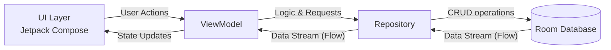

# 📦 InOutManager (재고 관리 앱)

**InOutManager**는 소규모 비즈니스 또는 개인의 사물, 상품들의 재고 상태를 체계적이고 직관적으로 관리할 수 있도록 돕는 안드로이드 애플리케이션입니다. 
Jetpack Compose 기반의 깔끔한 UI를 통해 입고와 출고 내역을 간편하게 기록하고, 현재 남은 재고 수량을 실시간으로 빠르고 정확하게 파악할 수 있습니다.

## 📱 앱 소개 (Overview)
- **손쉬운 재고 관리**: 직관적인 인터페이스로 누구나 쉽게 상품을 등록하고 입출고 처리를 할 수 있습니다.
- **실시간 현황 파악**: 모든 상품의 재고 수량과 입/출고 변동 내역을 한눈에 확인할 수 있습니다.
- **오프라인 동작**: Room Database를 사용하여 인터넷 연결 없이도 빠르고 안전하게 데이터를 기기 내에 저장하고 조회합니다.

## ✨ 핵심 기능 (Features)
1. **📥 입고 관리 (Inbound)**: 새로운 상품이 들어올 때 수량 및 관련 내역을 빠르고 안전하게 기록합니다.
2. **📤 출고 관리 (Outbound)**: 상품이 출고되거나 판매될 때 재고 수량을 정확히 차감하고 출고 내역을 기록합니다.
3. **📊 재고 현황 (Status)**: 현재 등록된 전체 상품의 목록과 남은 재고 파악을 리스트 형태로 한눈에 보여줍니다.

## 🛠 기술 스택 (Tech Stack)
- **Language**: Kotlin
- **UI Toolkit**: Jetpack Compose (Material Design 3)
- **Architecture**: MVVM 패턴 & 단방향 데이터 흐름 (UDF) 적용
- **Dependency Injection**: 수동 DI 컨테이너 패턴 (`AppContainer` 및 커스텀 `Application` 클래스 적용)
- **Local Database**: Room Database (SQLite DB 기반)
- **Asynchronous Programming**: Kotlin Coroutines & Flow

## 🏗 아키텍처 (Architecture)
본 프로젝트는 확장성과 유지보수성을 고려하여 레이어드 아키텍처를 지향합니다.

## 📂 프로젝트 구조 (Modules & Structure)
- `presentation/`: UI 및 ViewModel (Screen, Component, Theme)
- `domain/`: 비즈니스 로직 및 모델 (현재 `data` 레이어와 일부 혼재되어 있으며 개선 예정)
- `data/`: 데이터 소스 (Room Database, Repository implementation)
- `di/`: 의존성 주입 (AppContainer)
