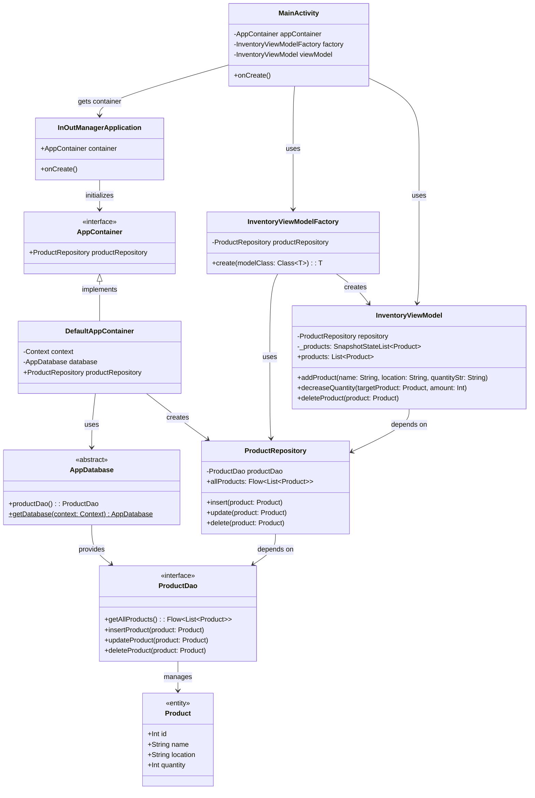

# InOutManager Architecture & Design

본 문서는 `InOutManager` 프로젝트의 주요 클래스 관계(UML Class Diagram)와 데이터 흐름 및 아키텍처(Architecture/Flow Diagram)를 보여주는 다이어그램을 포함하고 있습니다.
다이어그램은 GitHub에서 기본적으로 지원하는 [Mermaid](https://mermaid.js.org/)를 사용하여 작성되었습니다.

---

## 1. Architecture Flow Diagram (아키텍처 및 데이터 흐름 다이어그램)

앱의 전반적인 구조인 **UI Layer**, **Data Layer**, **Dependency Injection Layer**의 분리와 데이터의 흐름을 보여줍니다. 
Jetpack Compose에서 발생한 사용자 이벤트가 ViewModel을 거쳐 Room Database까지 도달하고 다시 UI로 상태가 갱신되는 Flow를 잘 보여줍니다.

```mermaid
flowchart TD
    subgraph UI_Layer [UI Layer (Presentation)]
        MA(MainActivity)
        IA(InventoryApp Composables)
        VM(InventoryViewModel)
        MA -->|Set Content| IA
        IA -->|Events & Collect State| VM
    end

    subgraph DI_Layer [Dependency Injection Container]
        App(InOutManagerApplication)
        Cont(DefaultAppContainer)
        App -->|Initializes| Cont
        MA -.->|Gets Factory/Dependencies from| Cont
    end

    subgraph Data_Layer [Data Layer]
        Repo(ProductRepository)
        Dao(ProductDao)
        DB(AppDatabase)
        Entity(Product Entity)
        
        Repo -->|Flow / Suspend calls| Dao
        DB -->|Provides| Dao
        Dao -->|CRUD| Entity
    end

    VM -->|Uses| Repo
    Cont -->|Provides Singleton| Repo
    Cont -->|Provides Singleton| DB

    %% Event Flow
    IA -- "1. User Input (Add/Update/Delete)" -.-> VM
    VM -- "2. Coroutines Logic" -.-> Repo
    Repo -- "3. Room DAO query" -.-> Dao
    Dao -- "4. Database operation" -.-> DB
    DB -- "5. Return Flow updates" -.-> Dao
    Dao -- "6. Return Flow" -.-> Repo
    Repo -- "7. Collect Flow" -.-> VM
    VM -- "8. State Update (Products List)" -.-> IA
```

---

## 2. UML Class Diagram (클래스 다이어그램)

앱 내부의 핵심 클래스 간의 구조와 의존성을 상세히 나타냅니다. 
싱글톤 패턴 설계와 의존성 주입(AppContainer), 그리고 Repository 패턴 적용 상태를 확인할 수 있습니다.


