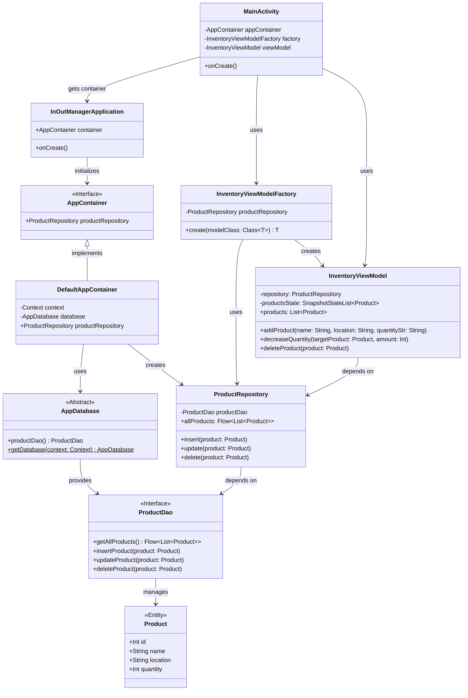

# InOutManager UML Class Diagram (Detailed)

이 문서는 **상세 버전 UML Class Diagram** 입니다.
타입 정보와 생성/의존 관계를 보다 명확히 드러내도록 작성했습니다.

---

## 해설

### 1. Application / Container
- `InOutManagerApplication`은 앱 전체 수명 주기 동안 유지되는 진입 Application 객체입니다.
- `AppContainer`는 의존성 공급 역할을 추상화한 인터페이스입니다.
- `DefaultAppContainer`는 실제 구현체이며 DB와 Repository를 초기화합니다.

### 2. UI / ViewModel
- `MainActivity`는 UI 진입점이며 Compose를 시작합니다.
- `InventoryViewModelFactory`는 필요한 의존성을 받아 `InventoryViewModel`을 생성합니다.
- `InventoryViewModel`은 화면 상태를 관리하고 사용자 이벤트를 처리합니다.

### 3. Data Layer
- `ProductRepository`는 데이터 접근 로직을 한곳에 모읍니다.
- `ProductDao`는 Room DAO 인터페이스입니다.
- `AppDatabase`는 Room Database 추상 클래스입니다.
- `Product`는 DB 테이블과 매핑되는 엔티티입니다.

---

## 왜 상세 버전이 필요한가

간단 버전 UML은 구조를 빠르게 보여주기에는 좋지만,
아래와 같은 정보는 상세 버전에서 더 잘 드러납니다.

- 어떤 멤버가 어떤 타입을 가지는지
- ViewModel이 어떤 Repository에 의존하는지
- 상태가 어떤 형태로 외부에 노출되는지
- Room 계층이 어떤 인터페이스와 클래스로 연결되는지

즉, 이 문서는 **설계 설명용** 문서라고 보면 됩니다.

---