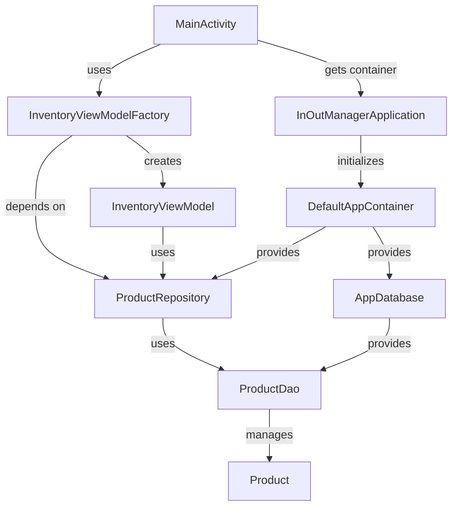
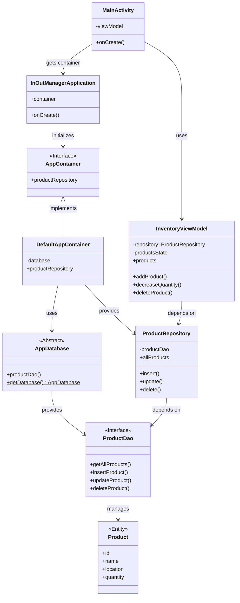

# InOutManager Architecture & Design

본 문서는 `InOutManager` 프로젝트의 주요 클래스 관계(UML Class Diagram)와 데이터 흐름 및 아키텍처(Architecture/Flow Diagram)를 보여주는 다이어그램을 포함하고 있습니다.
다이어그램은 GitHub에서 기본적으로 지원하는 [Mermaid](https://mermaid.js.org/)를 사용하여 작성되었습니다.

> GitHub Mermaid 렌더러 호환성을 위해 일부 문법을 안전한 형태로 정리했습니다.
> 특히 `subgraph` 제목 표기, 점선 화살표 표기, 클래스 다이어그램 내부 멤버 표기를 GitHub에서 안정적으로 렌더링되기 쉬운 형태로 수정했습니다.

---

## 1. Architecture Flow Diagram (아키텍처 및 데이터 흐름 다이어그램)

앱의 전반적인 구조인 **UI Layer**, **Data Layer**, **Dependency Injection Layer**의 분리와 데이터의 흐름을 보여줍니다.
Jetpack Compose에서 발생한 사용자 이벤트가 ViewModel을 거쳐 Room Database까지 도달하고 다시 UI로 상태가 갱신되는 흐름을 나타냅니다.

---

## 2. UML Class Diagram (클래스 다이어그램)

앱 내부의 핵심 클래스 간의 구조와 의존성을 상세히 나타냅니다.
싱글톤 패턴 설계와 의존성 주입(AppContainer), 그리고 Repository 패턴 적용 상태를 확인할 수 있습니다.

---

## 3. GitHub에서 깨졌던 이유 요약

기존 파일에서 GitHub Mermaid 렌더러와 충돌할 수 있었던 지점은 다음과 같습니다.

- `subgraph UI_Layer [UI Layer (Presentation)]` 형태의 제목 표기
- `-- "텍스트" -.->` 처럼 한 간선 안에서 서로 다른 화살표 문법을 혼합한 표기
- 클래스 다이어그램 내부 멤버에 타입/반환형/정적 표기를 복합적으로 넣은 표기

위 요소를 보수적으로 정리해 GitHub README 또는 GitHub Pages에서 바로 붙여넣어도 렌더링될 가능성이 높도록 수정했습니다.
